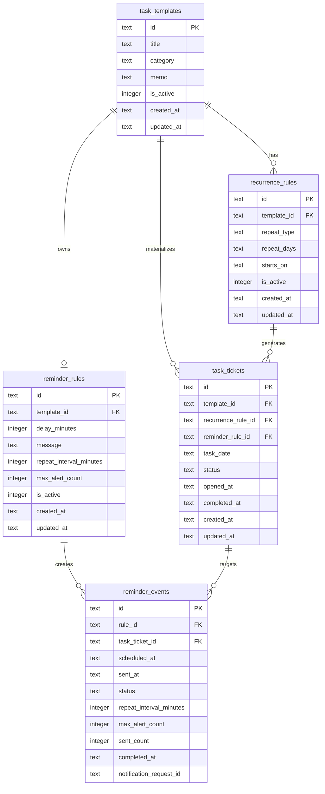

# ERD

현재 앱의 SQLite 스키마 기준 ERD입니다.

## 메모
- `task_templates`는 루틴 템플릿입니다.
- `recurrence_rules`는 반복 규칙입니다.
- `task_tickets`는 날짜별 실제 수행 티켓입니다.
- `task_tickets.reminder_rule_id`는 티켓 생성 시점의 알림 규칙 연결 정보를 스냅샷으로 가집니다.
- `reminder_rules`는 템플릿당 최대 1개의 활성 알림 규칙을 가집니다.
- `reminder_rules`는 지연 시간, 반복 간격, 최대 알림 횟수를 가집니다.
- `reminder_events`는 티켓 실행 이후 생성되는 알림 이벤트입니다.
