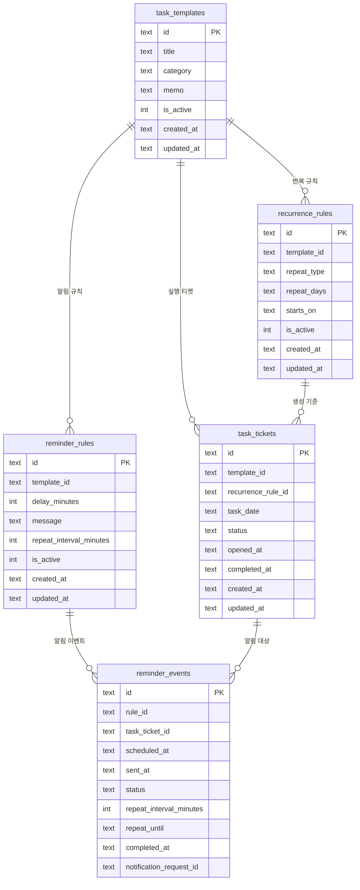

# 데이터 구조 개편안

## 1. 목적
- 반복 규칙과 실제 날짜별 실행 건을 분리한다.
- 과거 날짜에 티켓이 자동 생성되는 문제를 막는다.
- 오늘/달력 화면이 반복 규칙 계산이 아니라 실제 생성된 티켓만 기준으로 동작하게 한다.
- 알림도 실제 실행 티켓 기준으로 연결한다.

## 2. 이번 개편에서 확정한 정책
- 반복 테스크 원본 정의와 실제 실행 티켓은 분리한다.
- 1회성 테스크는 현재 범위에서 제외하고, 루틴 전용 구조를 우선 유지한다.
- 앱 실행 시 오늘치 티켓만 생성한다.
- 과거 티켓은 자동 생성하지 않는다.
- 미래 티켓도 미리 생성하지 않는다.
- 달력과 오늘 화면은 `task_tickets`만 표시한다.
- 기존 `task_logs`는 제거하고 티켓이 상태/시간을 직접 가진다.
- 알림 규칙은 템플릿 기준으로 연결하고, 알림 이벤트는 실제 티켓 기준으로 생성한다.
- 반복 규칙 수정/비활성화는 이미 생성된 티켓에는 영향을 주지 않고, 이후 생성분부터 반영한다.
- 개발 단계이므로 기존 데이터는 마이그레이션보다 초기화 후 새 구조로 전환한다.

## 3. 최종 ERD

## 4. 테이블별 컬럼 정의

### 4-1. `task_templates`
- 역할: 반복 테스크의 원본 정의
- 컬럼
  - `id`
  - `title`
  - `category`
  - `memo`
  - `is_active`
  - `created_at`
  - `updated_at`

### 4-2. `recurrence_rules`
- 역할: 날짜 생성 규칙 정의
- 컬럼
  - `id`
  - `template_id`
  - `repeat_type`
    - `DAILY`
    - `WEEKLY_DAYS`
  - `repeat_days`
    - JSON 배열 문자열
    - 예: `[1,3,5]`
  - `starts_on`
    - 이 날짜 이전에는 티켓 생성 안 함
  - `is_active`
  - `created_at`
  - `updated_at`

### 4-3. `task_tickets`
- 역할: 실제 날짜별 실행 건
- 컬럼
  - `id`
  - `template_id`
  - `recurrence_rule_id`
  - `task_date`
    - 이 티켓이 속한 업무 날짜
  - `status`
    - `PENDING`
    - `IN_PROGRESS`
    - `DONE`
  - `opened_at`
    - 필요 시 시작 시각
  - `completed_at`
    - 완료 체크 시각
  - `created_at`
    - 티켓 레코드 생성 시각
  - `updated_at`
- 제약
  - `UNIQUE(recurrence_rule_id, task_date)`
  - 규칙 기반으로 하루에 같은 티켓이 중복 생성되지 않게 함

### 4-4. `reminder_rules`
- 역할: 템플릿 기준 알림 정책
- 컬럼
  - `id`
  - `template_id`
  - `delay_minutes`
  - `message`
  - `repeat_interval_minutes`
  - `is_active`
  - `created_at`
  - `updated_at`

### 4-5. `reminder_events`
- 역할: 실제 티켓 완료 후 생성되는 알림 이벤트
- 컬럼
  - `id`
  - `rule_id`
  - `task_ticket_id`
  - `scheduled_at`
  - `sent_at`
  - `status`
    - `PENDING`
    - `COMPLETED`
    - `EXPIRED`
  - `repeat_interval_minutes`
  - `repeat_until`
  - `completed_at`
    - 사용자가 알림을 완료 처리한 시각
  - `notification_request_id`

## 5. 생성/조회 정책

### 5-1. 오늘 티켓 생성
- 앱 시작 시 오늘 날짜 기준으로 반복 규칙을 검사한다.
- 오늘 날짜에 해당하는 규칙만 `task_tickets`를 생성한다.
- 이미 존재하는 `(recurrence_rule_id, task_date)` 조합은 다시 만들지 않는다.

### 5-2. 과거 날짜 정책
- 과거 날짜 티켓은 자동 생성하지 않는다.
- 반복 규칙을 오늘 추가해도 과거 날짜에는 아무 티켓도 생기지 않는다.

### 5-3. 미래 날짜 정책
- 미래 티켓은 미리 생성하지 않는다.
- 내일 날짜는 내일 앱이 열릴 때 생성한다.

### 5-4. 화면 조회 정책
- `오늘` 탭은 오늘 날짜의 `task_tickets`만 조회한다.
- `달력` 탭도 해당 날짜 범위의 `task_tickets`만 조회한다.
- 반복 규칙만 있고 실제 티켓이 아직 생성되지 않은 날짜는 표시하지 않는다.

## 6. 알림 정책
- 템플릿당 활성 알림 규칙은 1개만 허용한다.
- 알림 규칙은 템플릿에 매달린다.
- 실제 알림 이벤트는 `task_ticket`이 `IN_PROGRESS`로 진입하는 시점에 생성한다.
- 알림 상태 의미
  - `PENDING`: 아직 살아있는 알림
  - `COMPLETED`: 사용자가 완료 처리한 알림
  - `EXPIRED`: 반복 종료 시각이 지나 자동 종료된 알림
- 알림이 연결된 티켓 상태 의미
  - `PENDING`: 아직 시작 전
  - `IN_PROGRESS`: 시작했지만 알림 확인이 아직 끝나지 않음
  - `DONE`: 알림 완료 처리까지 끝난 최종 완료 상태

## 7. 현재 구조 대비 변경점

### 7-1. 제거 또는 축소
- `tasks` 테이블은 `task_templates` 역할로 대체한다.
- `task_logs`는 제거한다.
- `isTaskScheduledForDate()`는 화면 조회용이 아니라 오늘 티켓 생성 대상 판정용으로 축소한다.

### 7-2. 새로 생기는 핵심 개념
- 반복 규칙은 "생성 기준"
- 티켓은 "실제 해야 할 건"
- 달력/오늘은 티켓만 본다

## 8. 파일별 수정 계획

### 8-1. `/Users/kim/projects/llm/secretary/mobile/src/domain/types.ts`
- `Task` 중심 타입을 분리
- 추가 예정 타입
  - `TaskTemplate`
  - `RecurrenceRule`
  - `TaskTicket`
- `ReminderEvent`는 `taskTicketId` 기준으로 수정

### 8-2. `/Users/kim/projects/llm/secretary/mobile/src/data/database.ts`
- 신규 테이블 생성
  - `task_templates`
  - `recurrence_rules`
  - `task_tickets`
- 기존 `tasks`, `task_logs` 제거 방향으로 초기화 로직 개편
- 개발 단계 기준 초기화 전환 여부 반영

### 8-3. `/Users/kim/projects/llm/secretary/mobile/src/data/tasks.ts`
- 가장 큰 변경 대상
- 템플릿 CRUD와 티켓 조회/상태 변경 책임을 분리
- 추가 예정 함수 예시
  - `createTaskTemplate()`
  - `updateTaskTemplate()`
  - `listTaskTemplates()`
  - `ensureTodayTaskTickets()`
  - `getTaskTicketsForDate()`
  - `getTaskTicketsForDates()`
  - `setTaskTicketStatus()`

### 8-4. `/Users/kim/projects/llm/secretary/mobile/src/data/reminders.ts`
- `trigger_task_id`를 `template_id` 기준으로 변경

### 8-5. `/Users/kim/projects/llm/secretary/mobile/src/data/reminder-events.ts`
- `triggered_by_task_log_id`를 제거
- `task_ticket_id` 기준으로 이벤트 생성/조회 로직 변경

### 8-6. `/Users/kim/projects/llm/secretary/mobile/src/lib/date.ts`
- 반복 규칙 판정 함수는 유지
- 역할을 "티켓 생성 대상 판정" 중심으로 재정리

### 8-7. `/Users/kim/projects/llm/secretary/mobile/App.tsx`
- 오늘 탭: `task_tickets` 기준 조회/체크
- 달력 탭: 날짜 범위 내 `task_tickets` 기준 조회
- 테스크 탭: 템플릿 + 반복 규칙 관리 UI로 역할 변경
- 알림 탭: 템플릿 기준 규칙, 티켓 기준 이벤트 표시

## 9. 구현 순서
1. 타입 정의 개편
2. DB 스키마 개편
3. 템플릿/반복 규칙/티켓 데이터 계층 분리
4. 앱 시작 시 오늘 티켓 생성 로직 추가
5. 오늘 탭을 티켓 기반으로 전환
6. 달력 탭을 티켓 기반으로 전환
7. 알림 규칙/이벤트 연결 구조 수정
8. 샘플 데이터와 초기화 로직 정리

## 10. 구현 전 주의사항
- 이번 개편은 UI 수정이 아니라 데이터 모델 전환 작업이다.
- 중간 단계에서 기존 `tasks/task_logs`와 새 구조를 섞으면 복잡도가 급격히 올라간다.
- 개발 단계이므로 호환 마이그레이션보다 초기화 후 일괄 전환이 더 안전하다.
